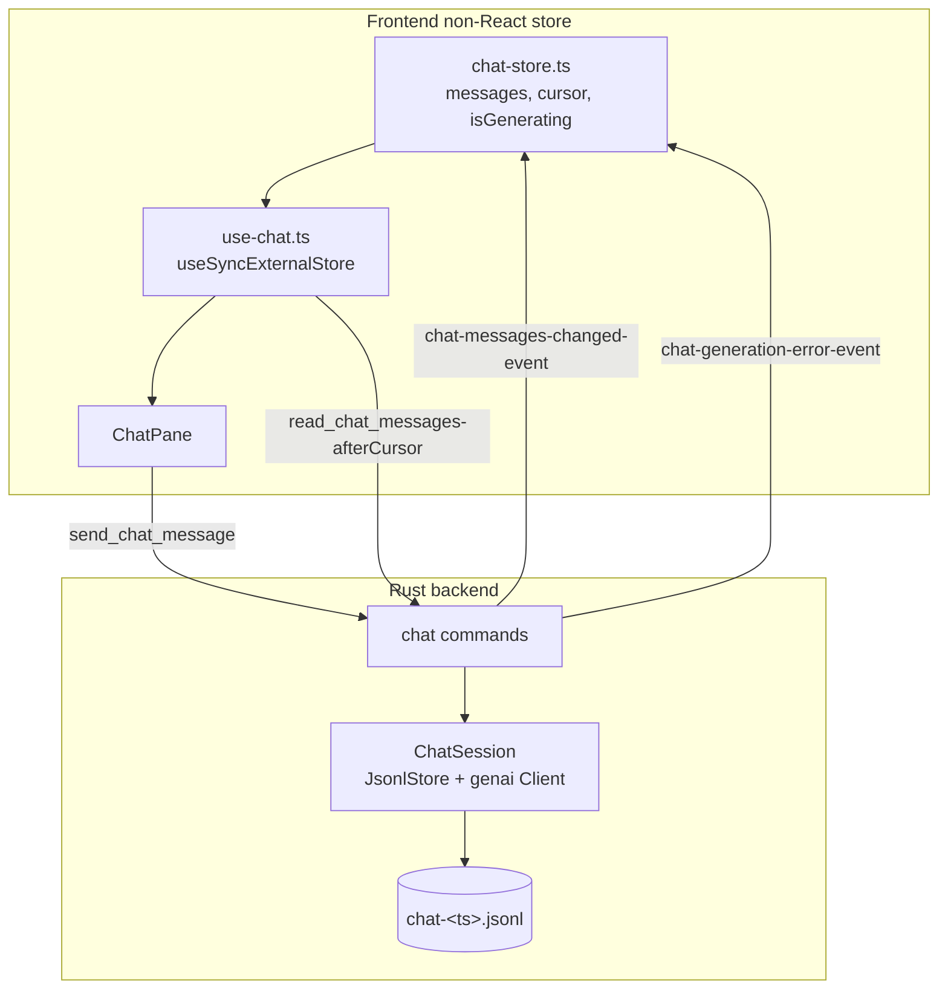
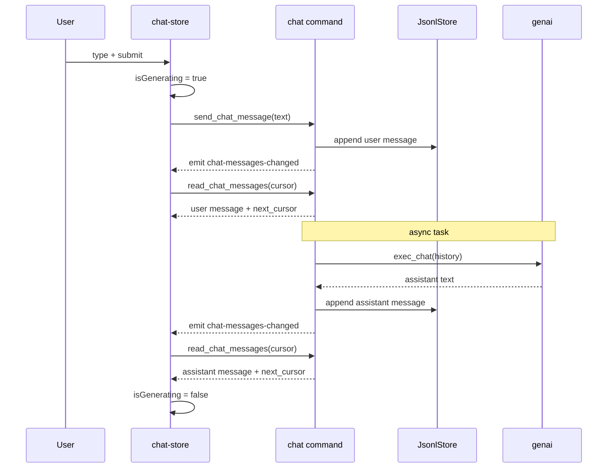

# Chat Implementation Plan

## Goal

Implement basic chat functionality alongside the existing terminal:

- One chat **session per application run** (no session switching/listing yet).
- Persist session messages with `JsonlStore`.
- Keep FE and BE in sync using **message IDs as a read cursor**.
- Generate assistant answers with the `genai` crate.
- Block chat submit button while the assistant is generating.
- Frontend keeps chat state **outside React** and only touches chat (not the terminal).

## Confirmed Decisions

| Topic                    | Decision                                                                                                         |
| ------------------------ | ---------------------------------------------------------------------------------------------------------------- |
| Model                    | `gemini-3.1-flash-lite` (hardcoded constant for now)                                                             |
| Credentials              | Default `genai` Gemini env var (e.g. `GEMINI_API_KEY`); not surfaced in UI                                       |
| Streaming                | None — persist + emit the assistant message once fully generated                                                 |
| Sync model               | Hybrid: initial pull on mount + BE event `chat-messages-changed`, FE pulls everything after its last-seen cursor |
| Session file             | One JSONL file per session, filename derived from a startup timestamp (e.g. `chat-<timestamp>.jsonl`)            |
| `id` field               | Not serialized into JSON; populated by `on_read` as an **opaque string cursor** (FE never parses it)             |
| `commandline` / `output` | Stubbed as `None` (carried in the type, no terminal integration yet)                                             |

---

## Architecture Overview



**Single source of truth = the JSONL file.** The FE never holds authoritative state; it pulls from the store using its cursor whenever notified. Optimistic UI is avoided to keep the model simple.

---

## Backend

### 1. `JsonlStore` adjustment (`src-tauri/src/jsonl_store.rs`)

The current `read(start_id, count) -> Vec<T>` is **inclusive by byte offset**, so a cursor equal to the last message's id would re-read that message. We need the FE to advance past the messages it already has.

**Change:** make `read` return both the messages and the **next cursor** (byte offset immediately past the last returned message). Keep it generic.

```rust
pub struct ReadPage<T> {
    pub items: Vec<T>,
    /// Byte offset to pass as `start_id` on the next read.
    pub next_id: u32,
}

pub fn read(&self, start_id: u32, count: Option<u32>) -> Result<ReadPage<T>, JsonlStoreError>;
```

- `next_id` = `start_id + bytes consumed` (already tracked internally by the `offset` local).
- When no messages are read, `next_id == start_id`.
- Update the existing unit tests to read `.items` / assert `.next_id`.
- `on_read` keeps its `Fn(&mut T, u32)` signature; the chat layer stringifies the offset into `ChatMessage.id`.

> Rationale: per-message `id` (its own offset, for React keys/dedup) and the pagination cursor (`next_id`) both derive from byte offsets but serve different purposes. Returning `next_id` keeps the store generic and avoids leaking line-length math to callers.

### 2. `chat.rs`

- Keep the `ChatMessage` enum. Adjust `id` so it is **not serialized** but populated on read:

  ```rust
  #[serde(default, skip_serializing)]
  id: String,
  ```

  `JsonlStore::with_on_read` sets it via `m.set_id(offset.to_string())` (offset stringified; FE treats it opaque).

- `commandline` and `output` remain `Option<String>`, always `None` for now.
- Add a `ChatSession` that owns the store, the session id, the `genai` Client, and a generating flag:

  ```rust
  pub struct ChatSession {
      pub id: String,                       // timestamp-based, e.g. "20260616-101530"
      store: JsonlStore<ChatMessage>,
      client: genai::Client,
      generating: std::sync::atomic::AtomicBool,
  }
  ```

- Constants: `const MODEL: &str = "gemini-3.1-flash-lite";`
- Methods:
  - `append_user(msg) -> id`
  - `read_page(start_cursor: Option<u32>) -> ReadPage<ChatMessage>`
  - `history_for_genai()` — load all messages, map to `genai::chat::ChatMessage` roles (User/Assistant) for context.
  - `generate(app: &AppHandle)` — build request from history, call `client.exec_chat(MODEL, ...)`, append the assistant message, flip `generating` off, emit events.

### 3. App state & wiring (`src-tauri/src/lib.rs`)

- `mod chat;`
- On startup (`setup`):
  - Resolve `app_data_dir` via `app.path()`.
  - Build session id from current timestamp; create `JsonlStore::new(dir, "chat-<ts>.jsonl")` configured `.with_on_read(set id)`.
  - Construct `genai::Client` (reads key from env).
  - `app.manage(ChatSession { ... })`.

### 4. Commands (registered in `generate_handler!`)

| Command              | Signature                                                              | Behavior                                                                                                                                                                                                                                                  |
| -------------------- | ---------------------------------------------------------------------- | --------------------------------------------------------------------------------------------------------------------------------------------------------------------------------------------------------------------------------------------------------- |
| `get_chat_session`   | `() -> ChatSessionInfo { id }`                                         | Returns the current session id.                                                                                                                                                                                                                           |
| `read_chat_messages` | `(after_cursor: Option<String>) -> ChatPage { messages, next_cursor }` | Parses the opaque cursor to `u32`, reads from the store, returns messages + stringified `next_cursor`.                                                                                                                                                    |
| `send_chat_message`  | `(text: String) -> Result<(), String>`                                 | Rejects if already generating. Sets `generating=true`, appends user message, emits `chat-messages-changed`, then spawns an async task that calls `genai`, appends the assistant message (or emits error), clears the flag, emits `chat-messages-changed`. |

### 5. Events (emitted by BE)

- `chat-messages-changed` — payload `{ latestId: string }`. Signals the FE to pull everything after its cursor. Emitted after the user message is written **and** after the assistant message is written.
- `chat-generation-error` — payload `{ message: string }`. Unblocks input and surfaces an error.

### 6. Dependencies

- `genai = "0.6.5"` already present.
- No `uuid` dependency needed (timestamp-based session id).

---

## Frontend

Create `src/app/chat/` (kebab-case folder with an `index.ts` re-exporting public symbols), replacing the current `src/app/chat-pane.tsx` mock.

### 1. Global state outside React — `chat-store.ts`

A small vanilla store (no React) exposing `getSnapshot`, `subscribe`, and mutators, consumed via `useSyncExternalStore`.

State shape:

```ts
interface ChatState {
  messages: ChatMessageView[]; // mapped from BE ChatMessage
  cursor: string | null; // opaque next-read cursor
  isGenerating: boolean;
  error: string | null;
}
```

Responsibilities:

- `init()` — call `getChatSession`, then `readChatMessages(null)`; store messages + `next_cursor`; register event listeners (`chat-messages-changed`, `chat-generation-error`).
- `pull()` — on `chat-messages-changed`, call `readChatMessages(cursor)`, append returned messages (dedupe by `id`), advance cursor. If any appended message is an assistant message, set `isGenerating = false`.
- `send(text)` — set `isGenerating = true`, clear error, call `sendChatMessage({ text })`. New messages arrive via the pull triggered by the BE event. On rejection, set error + `isGenerating = false`.
- On `chat-generation-error` — set error, `isGenerating = false`.

Listeners are registered once at module/init scope (mirrors the "global, outside component" intent noted in `terminal-pane.tsx`).

### 2. React binding — `use-chat.ts`

`useChat()` uses `useSyncExternalStore` to read `messages`, `isGenerating`, `error`, and exposes `send`. Triggers `init()` once.

### 3. Component — `ChatPane`

Reuse the existing layout/markup from the current `chat-pane.tsx`. Changes:

- Render `messages` from the store (map `User`/`Assistant` variant -> sender styling). Use message `id` as the React key.
- Bind the `Textarea` value to local component state; submit on button click / Enter.
- **Disable the `Textarea` and submit `IconButton` when `isGenerating`** (and show a subtle generating indicator).
- Show `error` inline when present.

`app.tsx` already renders `<ChatPane />`; update the import to the new `./chat` module.

### 4. Generated bindings

After BE commands/events compile, run `pnpm tauri-typegen` to regenerate `src/generated/*`. Do **not** hand-edit generated files. The FE imports `getChatSession`, `readChatMessages`, `sendChatMessage`, and the `onChatMessagesChanged` / `onChatGenerationError` listeners from `@/generated`.

---

## Data Flow: sending a message



---

## Implementation Steps

1. **`jsonl_store.rs`** — add `ReadPage<T>`, change `read` to return it, update tests. Run `cargo test`.
2. **`chat.rs`** — `id` serde change + setter, `ChatSession`, model constant, append/read/history/generate methods.
3. **`lib.rs`** — `mod chat`, build session in `setup`, `manage` it, add the three commands + event payloads to `generate_handler!`.
4. `cargo check` / `cargo test` in `src-tauri/`.
5. **`pnpm tauri-typegen`** — regenerate bindings.
6. **FE** — create `src/app/chat/` (`chat-store.ts`, `use-chat.ts`, `ChatPane`, `index.ts`); update `app.tsx` import; remove the old `chat-pane.tsx` mock.
7. `pnpm build` (tsc + vite) to type-check.
8. **Manual verification** with `pnpm tauri dev` (requires the Gemini env var set): send a message, confirm input blocks during generation, the assistant reply appears, and history persists in `chat-<ts>.jsonl`.

## Out of Scope (for now)

- Multiple/persisted/selectable sessions and session history UI.
- Token streaming.
- Terminal context injection into `commandline` / `output`.
- Editing/deleting/retrying messages.
- Model/provider configuration UI.
